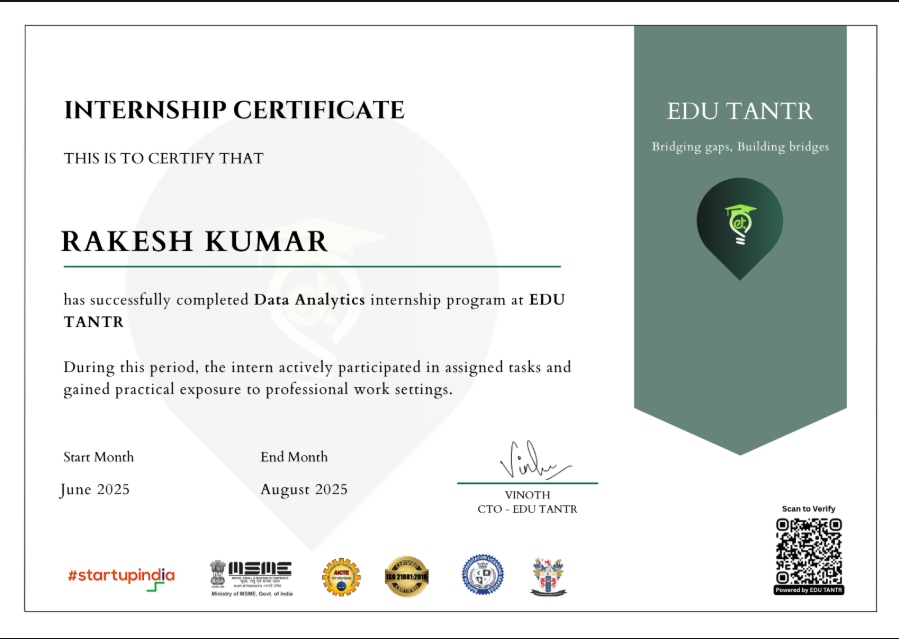

# 📊 Data Analytics Internship — EDU TANTR

## 🏢 About the Internship

I successfully completed a **Data Analytics Internship at EDU TANTR** from **June 2025 to August 2025**.

During this internship, I gained practical exposure to professional analytics workflows, including basic reporting, data preparation, dashboard development, and visualization.

The internship helped me understand how data can be transformed into meaningful insights to support reporting and decision-making.

---

## 🎯 Internship Objectives

- Understand the fundamentals of Data Analytics
- Gain practical exposure to real-world data
- Learn data cleaning and preparation techniques
- Create reports and dashboards
- Develop analytical and problem-solving skills
- Understand professional reporting workflows

---

## 🛠️ Skills & Tools

| Skill / Tool | Application |
|---|---|
| 📊 Power BI | Dashboard Development & Visualization |
| 🗄️ SQL | Data Querying & Analysis |
| 📗 Excel | Data Preparation & Reporting |
| 🧹 Data Cleaning | Preparing data for analysis |
| 📈 Data Visualization | Presenting insights effectively |
| 📑 Reporting | Creating analytical reports |

---

## 💼 Internship Experience

During my internship at **EDU TANTR**, I worked on activities related to:

### 📊 Data Analysis
- Worked with datasets for analytical purposes.
- Performed basic data preparation and cleaning.
- Identified useful information from available data.

### 📈 Dashboard Development
- Created and worked with dashboards for reporting.
- Used visualizations to communicate important information.
- Practiced presenting data in a clear and understandable format.

### 📑 Reporting
- Prepared reports and visual summaries.
- Developed an understanding of how analytical results can support decision-making.

### 🧠 Professional Learning
- Gained exposure to professional work environments.
- Improved analytical thinking and problem-solving.
- Strengthened communication and presentation skills.

---

## 📜 Internship Certificate

### EDU TANTR — Data Analytics Internship

**Internship Duration:** June 2025 – August 2025

**Intern:** Rakesh Kumar

**Program:** Data Analytics Internship

> Successfully completed the Data Analytics internship program at EDU TANTR.

---

## 📌 Key Takeaways

Through this internship, I gained practical exposure to:

- Data Analytics
- Data Cleaning
- Power BI
- SQL
- Excel
- Dashboard Development
- Data Visualization
- Reporting
- Professional Communication

This experience helped me strengthen my foundation in **Data Analytics** and motivated me to continue developing my skills toward a career as a **Data Analyst**.

---

## 🚀 Career Focus

I am currently developing my skills in:

**Power BI • SQL • Excel • Python • Data Analytics**

My goal is to build practical analytics projects and develop strong skills in **dashboard development, reporting, data visualization, and business analysis**.

---

## 👨‍💻 About Me

**Rakesh Kumar A**

🎓 BCA — University of Madras  
📊 Aspiring Data Analyst  
💡 Interested in Data Analytics & Business Intelligence

### Connect With Me

- 💼 LinkedIn: [Rakesh Kumar]((https://www.linkedin.com/in/rakeshkumar-dataanalyst/))
- 🐙 GitHub: [Rakesh Kumar]((https://github.com/Rakesh-Kumar24))

---

⭐ *This repository documents my learning and experience during my Data Analytics Internship at EDU TANTR.*
